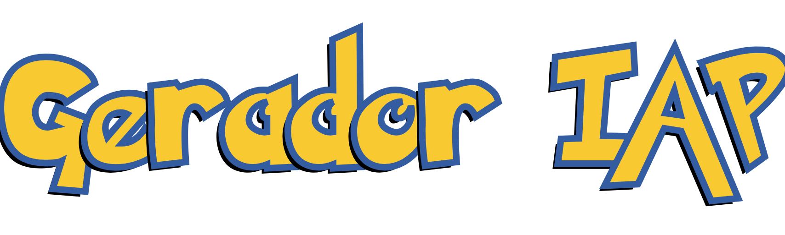

# Poke-Projeto-ALA
 Trabalho final de Álgebra Linear Algorítmica de Ian Mascaro e Vinícius Leoni

  
**AUTORES:**
- Ian Mascaro Salomão - DRE: *123162270*
- Vinícius Leoni Gonçalves - DRE: *121083446*
    
# **BEM-VINDO, TREINADOR!**  
***  
Este é o **Gerador de Índice de Afinidade Pokémon (IAP)**!  

O objetivo desta ferramenta é ajudar treinadores a identificar os Pokémon cujos status base são mais semelhantes ao de seu Pokémon de interesse. O cálculo leva em conta tanto a **distribuição dos valores entre os diferentes atributos** quanto a **magnitude absoluta de cada um**, garantindo uma análise detalhada, estratégica e precisa.  

## **APLICAÇÕES PRÁTICAS**  
- **Reforçando sua jornada:** Se você perdeu um de seus companheiros ao longo da jornada por Kanto, o Gerador de IAP encontra espécies com perfis semelhantes, permitindo que você continue batalhando sem perder a essência do seu time.  
- **Vantagem tática em ginásios:** Substitua Pokémon com desvantagens de tipo por companheiros mais adequados, mantendo equilíbrio e competitividade nas batalhas.  
- **Planejamento estratégico:** Ideal para montar equipes focadas em características específicas, como alta ou baixa velocidade, golpes físicos ou especiais, e até mesmo balancear sua composição geral de equipe.  

    
